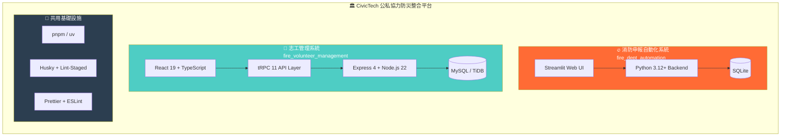
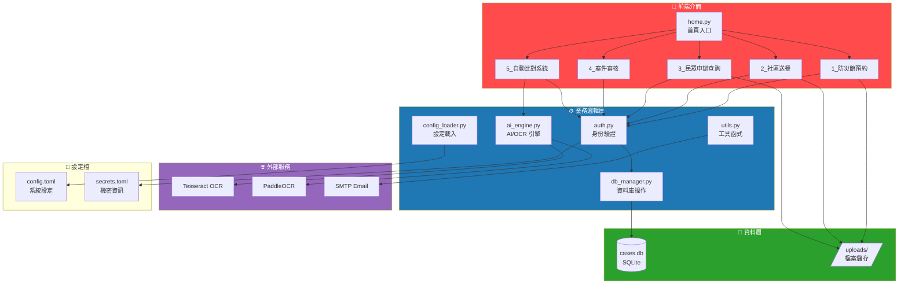
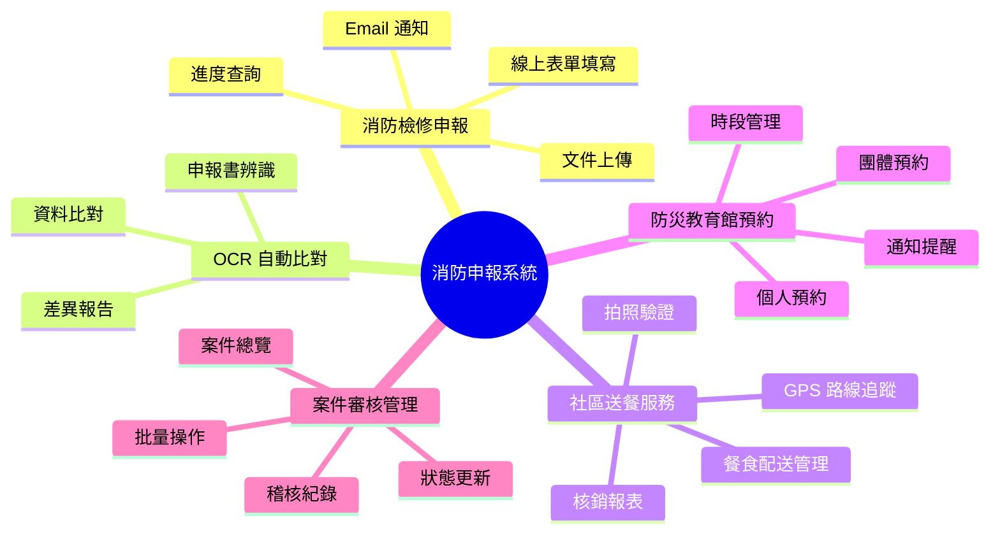
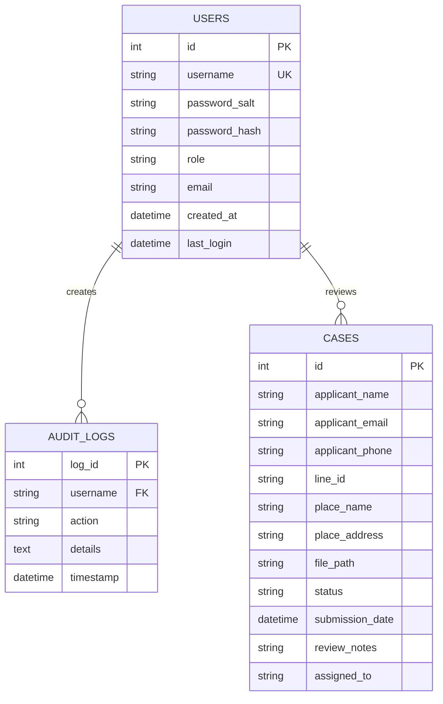
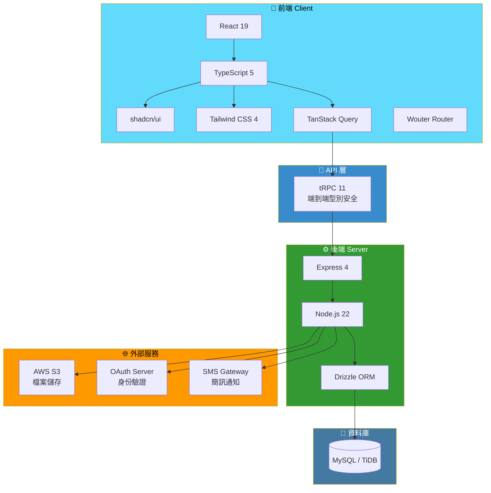
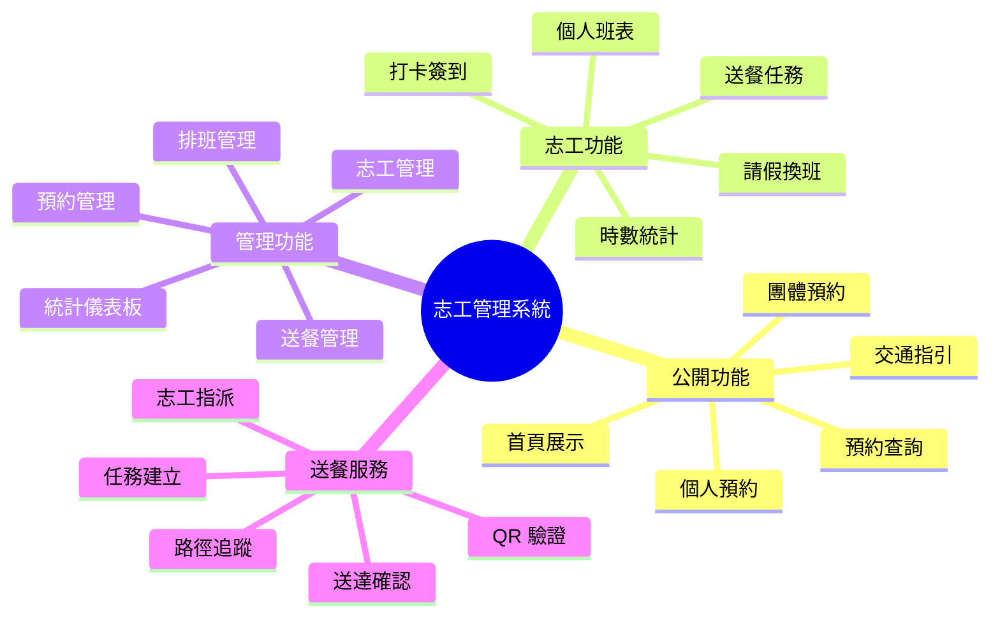
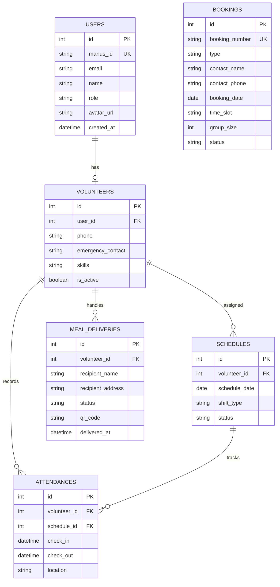
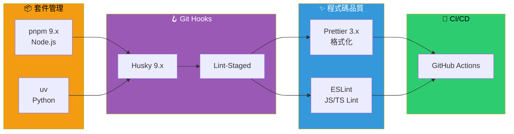
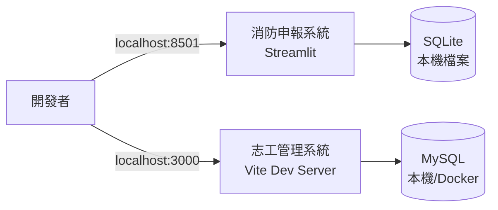
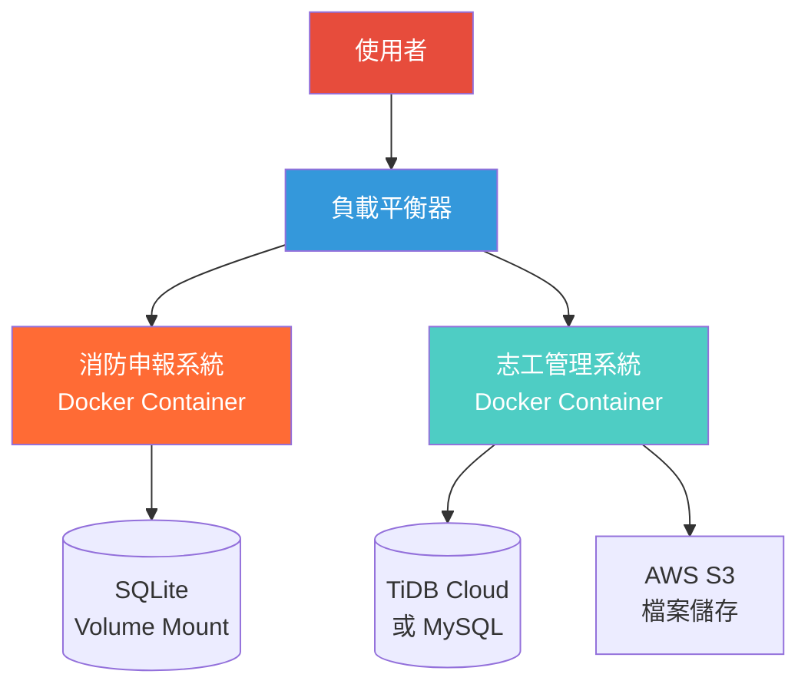

# 🏛️ CivicTech System Architecture

**[English](ARCHITECTURE_EN.md)** | 繁體中文

> 本文件詳細說明 CivicTech 公私協力防災整合系統的技術架構、子系統組成與技術棧。

---

## 📊 系統總覽

CivicTech 採用 **Monorepo** 架構，整合兩個獨立但互補的子系統：



---

## 🔥 消防申報自動化系統

### 系統架構圖



### 技術棧

| 類別 | 技術 | 版本 | 說明 |
|------|------|------|------|
| **框架** | Streamlit | 1.31+ | Python Web 應用框架 |
| **語言** | Python | 3.12+ | 主要程式語言 |
| **資料庫** | SQLite | 3.x | 輕量級嵌入式資料庫 |
| **OCR** | Tesseract | 5.x | 開源 OCR 引擎 |
| **OCR** | PaddleOCR | 2.x | 高精度中文 OCR |
| **PDF** | PyMuPDF | 1.x | PDF 處理與轉換 |
| **資料處理** | Pandas | 2.x | 資料分析與處理 |
| **加密** | bcrypt | 4.x | 密碼雜湊加密 |
| **圖像** | Pillow | 10.x | 圖像處理 |
| **郵件** | smtplib | - | SMTP 郵件發送 |

### 功能模組



### 資料庫結構



---

## 👥 志工管理系統

### 系統架構圖



### 技術棧

| 類別 | 技術 | 版本 | 說明 |
|------|------|------|------|
| **前端框架** | React | 19 | 使用者介面函式庫 |
| **型別系統** | TypeScript | 5.x | 靜態型別檢查 |
| **UI 組件** | shadcn/ui | - | 可自訂 UI 組件庫 |
| **CSS 框架** | Tailwind CSS | 4 | Utility-first CSS |
| **狀態管理** | TanStack Query | 5.x | 伺服器狀態管理 |
| **路由** | Wouter | 3.x | 輕量級路由 |
| **API** | tRPC | 11 | 端到端型別安全 API |
| **後端框架** | Express | 4.x | Node.js Web 框架 |
| **執行環境** | Node.js | 22.x | JavaScript 執行環境 |
| **ORM** | Drizzle | - | TypeScript ORM |
| **資料庫** | MySQL/TiDB | 8.x | 關聯式資料庫 |
| **檔案儲存** | AWS S3 | - | 雲端物件儲存 |
| **測試** | Vitest | 2.x | 單元測試框架 |

### 功能模組



### 資料庫結構



---

## 🔧 共用基礎設施

### 開發工具鏈



### 專案目錄結構

```
CivicTech/
├── 📂 fire_dept_automation/        # 🔥 消防申報自動化系統
│   ├── home.py                     # 主程式入口
│   ├── pages/                      # Streamlit 多頁面
│   │   ├── 1_disaster_prevention_museum_booking.py
│   │   ├── 2_community_meal_delivery.py
│   │   ├── 3_public_application_and_inquiry.py
│   │   ├── 4_case_review.py
│   │   └── 5_auto_comparison_system.py
│   ├── db_manager.py               # 資料庫操作
│   ├── ai_engine.py                # AI/OCR 引擎
│   ├── utils.py                    # 工具函式
│   ├── config.toml                 # 系統設定
│   ├── pyproject.toml              # Python 依賴
│   └── tests/                      # 測試檔案
│
├── 📂 fire_volunteer_management/   # 👥 志工管理系統
│   ├── client/                     # 前端 React 應用
│   │   └── src/
│   │       ├── pages/              # 頁面組件
│   │       ├── components/         # UI 組件
│   │       └── hooks/              # 自訂 Hooks
│   ├── server/                     # 後端 Express + tRPC
│   ├── drizzle/                    # 資料庫 Schema
│   ├── shared/                     # 共用型別
│   ├── package.json                # Node.js 依賴
│   └── vitest.config.ts            # 測試設定
│
├── 📂 docs/                        # 📚 文件
│   ├── ARCHITECTURE.md             # 系統架構（本文件）
│   ├── QUICK_REFERENCE.md          # 快速參考
│   └── SYSTEM_INTEGRATION.md       # 系統整合
│
├── start-all.ps1                   # 整合啟動腳本
├── package.json                    # Monorepo 設定
├── .husky/                         # Git Hooks
└── .prettierrc                     # Prettier 設定
```

---

## 🚀 部署架構

### 開發環境



### 生產環境



---

## 📝 更新紀錄

| 日期 | 版本 | 變更內容 |
|------|------|----------|
| 2026-01-31 | 1.0.0 | 初始版本 |

---

<div align="center">

**CivicTech - 打造整合的公私協力防災平台**

[← 返回 README](../README.md) | [系統整合說明 →](SYSTEM_INTEGRATION.md)

</div>
