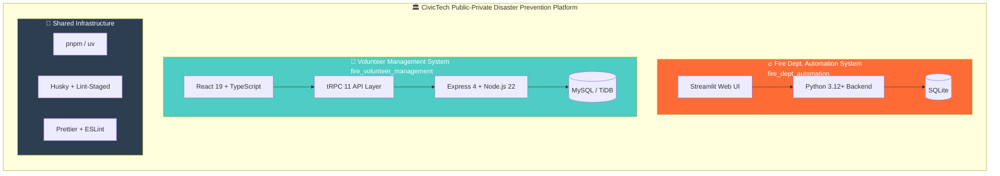
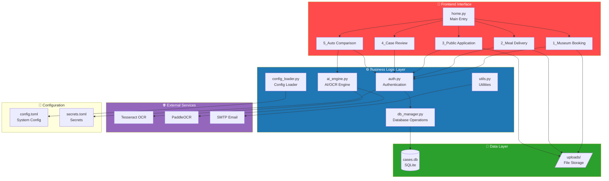
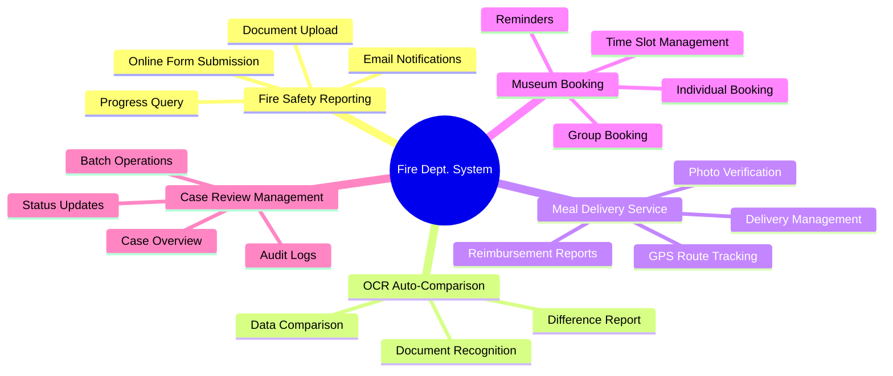
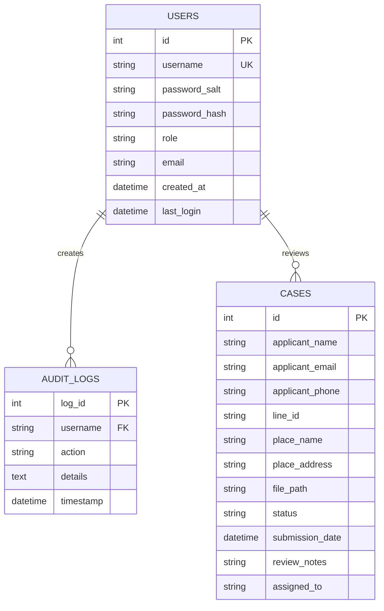
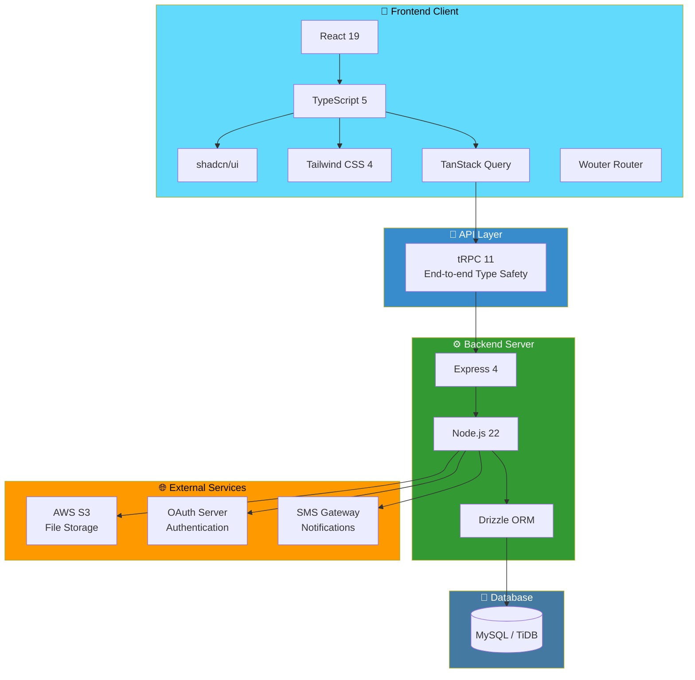
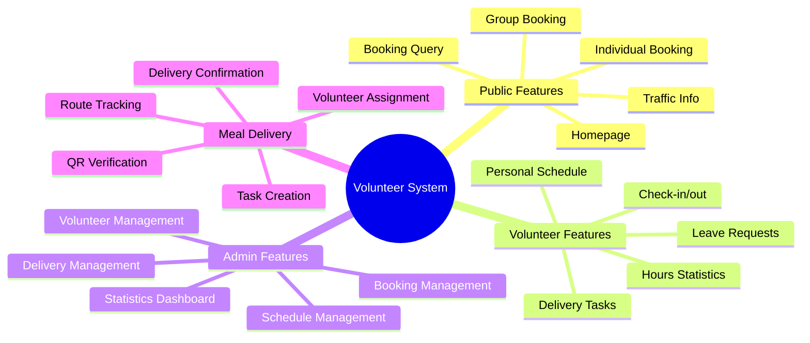
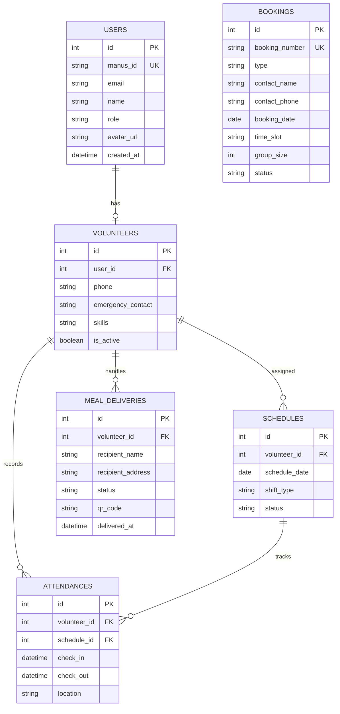
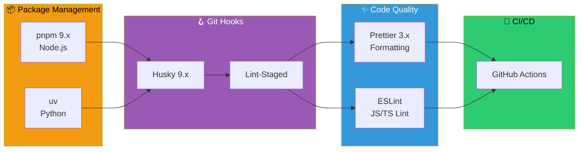
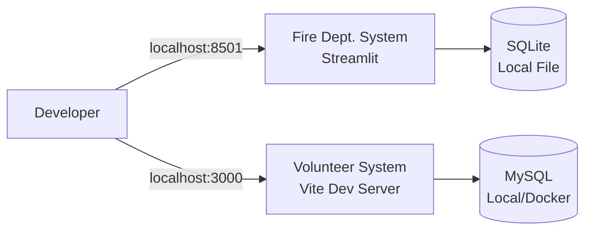
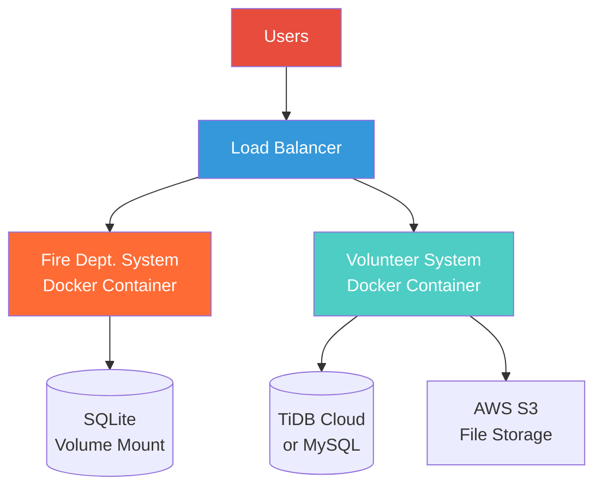

# 🏛️ CivicTech System Architecture

English | **[繁體中文](ARCHITECTURE.md)**

> This document details the technical architecture, subsystem composition, and tech stack of the CivicTech Public-Private Disaster Prevention Integration System.

---

## 📊 System Overview

CivicTech uses a **Monorepo** architecture, integrating two independent but complementary subsystems:



---

## 🔥 Fire Department Automation System

### System Architecture Diagram



### Tech Stack

| Category | Technology | Version | Description |
|----------|------------|---------|-------------|
| **Framework** | Streamlit | 1.31+ | Python Web application framework |
| **Language** | Python | 3.12+ | Primary programming language |
| **Database** | SQLite | 3.x | Lightweight embedded database |
| **OCR** | Tesseract | 5.x | Open-source OCR engine |
| **OCR** | PaddleOCR | 2.x | High-accuracy Chinese OCR |
| **PDF** | PyMuPDF | 1.x | PDF processing and conversion |
| **Data Processing** | Pandas | 2.x | Data analysis and processing |
| **Encryption** | bcrypt | 4.x | Password hashing |
| **Image** | Pillow | 10.x | Image processing |
| **Email** | smtplib | - | SMTP email sending |

### Feature Modules



### Database Schema



---

## 👥 Volunteer Management System

### System Architecture Diagram



### Tech Stack

| Category | Technology | Version | Description |
|----------|------------|---------|-------------|
| **Frontend Framework** | React | 19 | UI component library |
| **Type System** | TypeScript | 5.x | Static type checking |
| **UI Components** | shadcn/ui | - | Customizable UI components |
| **CSS Framework** | Tailwind CSS | 4 | Utility-first CSS |
| **State Management** | TanStack Query | 5.x | Server state management |
| **Routing** | Wouter | 3.x | Lightweight router |
| **API** | tRPC | 11 | End-to-end type-safe API |
| **Backend Framework** | Express | 4.x | Node.js web framework |
| **Runtime** | Node.js | 22.x | JavaScript runtime |
| **ORM** | Drizzle | - | TypeScript ORM |
| **Database** | MySQL/TiDB | 8.x | Relational database |
| **File Storage** | AWS S3 | - | Cloud object storage |
| **Testing** | Vitest | 2.x | Unit testing framework |

### Feature Modules



### Database Schema



---

## 🔧 Shared Infrastructure

### Development Toolchain



### Project Directory Structure

```
CivicTech/
├── 📂 fire_dept_automation/        # 🔥 Fire Dept. Automation System
│   ├── home.py                     # Main entry point
│   ├── pages/                      # Streamlit multi-page
│   │   ├── 1_disaster_prevention_museum_booking.py
│   │   ├── 2_community_meal_delivery.py
│   │   ├── 3_public_application_and_inquiry.py
│   │   ├── 4_case_review.py
│   │   └── 5_auto_comparison_system.py
│   ├── db_manager.py               # Database operations
│   ├── ai_engine.py                # AI/OCR engine
│   ├── utils.py                    # Utility functions
│   ├── config.toml                 # System configuration
│   ├── pyproject.toml              # Python dependencies
│   └── tests/                      # Test files
│
├── 📂 fire_volunteer_management/   # 👥 Volunteer Management System
│   ├── client/                     # Frontend React app
│   │   └── src/
│   │       ├── pages/              # Page components
│   │       ├── components/         # UI components
│   │       └── hooks/              # Custom hooks
│   ├── server/                     # Backend Express + tRPC
│   ├── drizzle/                    # Database schema
│   ├── shared/                     # Shared types
│   ├── package.json                # Node.js dependencies
│   └── vitest.config.ts            # Test configuration
│
├── 📂 docs/                        # 📚 Documentation
│   ├── ARCHITECTURE.md             # System architecture (this doc)
│   ├── QUICK_REFERENCE.md          # Quick reference
│   └── SYSTEM_INTEGRATION.md       # System integration
│
├── start-all.ps1                   # Integrated startup script
├── package.json                    # Monorepo configuration
├── .husky/                         # Git hooks
└── .prettierrc                     # Prettier configuration
```

---

## 🚀 Deployment Architecture

### Development Environment



### Production Environment



---

## 📝 Changelog

| Date | Version | Changes |
|------|---------|---------|
| 2026-01-31 | 1.0.0 | Initial version |

---

<div align="center">

**CivicTech - Building an Integrated Public-Private Disaster Prevention Platform**

[← Back to README](../README_EN.md) | [System Integration →](SYSTEM_INTEGRATION.md)

</div>
