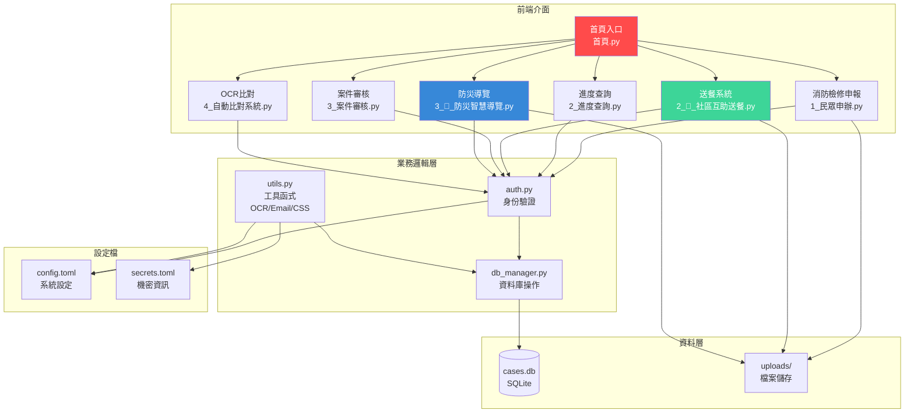

# 🚒 臺東縣消防局檢修申報自動化系統

> Fire Safety Equipment Inspection Automation System for Taitung County Fire Department

[](https://www.python.org/)
[](https://streamlit.io/)
[](LICENSE)

## 📋 專案簡介

本系統為**臺東縣消防局公私協力防災媒合平台**，整合三大子系統於單一平台：

### 🎯 三大子系統

1. **🚒 消防檢修申報系統**
   - 線上申報與審核管理
   - OCR 自動比對功能
   - Email 通知與稽核紀錄

2. **🍱 社區互助送餐系統**
   - 長照餐食配送管理
   - 互動式日曆排班
   - 強制拍照驗證（符合公部門核銷）
   - GPS 路線導航

3. **📢 防災智慧導覽系統**
   - 防災教育館線上預約
   - 影音防災知識庫
   - 團體/個人預約管理

## 🏗️ 系統架構圖



### 核心功能

- **📝 線上申報**：民眾可線上填寫申請表並上傳檢修申報書
- **🔍 進度查詢**：支援單號查詢與 Email 查詢
- **👮 案件審核**：消防局人員專用審核管理介面
  - 案件總覽與批量操作（全選、派案、刪除）
  - 單筆審核與狀態更新
  - Email 自動通知（HTML 模板）
- **🤖 OCR 自動比對**：申報書與系統資料自動比對
- **👥 人員管理**：帳號管理與權限控制
- **🔐 安全認證**：
  - 管理員二階段驗證 (2FA)
  - 密碼加密儲存 (bcrypt)
  - 內部同仁自助註冊（部門通行碼驗證）
- **📊 系統紀錄**：完整的操作稽核紀錄

### ✨ 特色亮點

- 🎨 **現代化 UI**：自訂 CSS 樣式，側邊欄懸停特效、Tab 大字體
- 🔥 **消防紅主題**：符合消防局形象的配色設計
- 📧 **精美 Email 模板**：統一的 HTML 郵件樣式
- 💾 **智慧記憶**：OCR 路徑、表格狀態自動保存
- 📱 **Line ID 整合**：為未來 Line 官方帳號整合預留欄位

---

## 🚀 快速開始

### 方法一：Windows 一鍵啟動（推薦）

```bash
# 1. 雙擊 run.bat
# 2. 系統自動完成環境檢查、依賴安裝、啟動服務
# 3. 瀏覽器自動開啟 http://localhost:8501
```

### 方法二：手動啟動

```bash
# 1. 安裝依賴
pip install -r requirements.txt

# 2. 啟動系統
streamlit run 首頁.py
```

### 方法三：Docker 部署

```bash
# 使用 Docker Compose（推薦）
docker-compose up -d

# 或使用 Docker
docker build -t fire-dept-app .
docker run -p 8501:8501 fire-dept-app
```

詳細部署說明請參考 [DEPLOYMENT.md](DEPLOYMENT.md)

---

## 📦 系統架構

```
fire_dept_automation/
├── 首頁.py                    # 主程式入口
├── auth.py                    # 認證與密碼管理
├── db_manager.py              # 資料庫操作
├── utils.py                   # 工具函式（OCR、Email、CSS）
├── pages/                     # 多頁面應用
│   ├── 1_民眾申辦.py
│   ├── 2_進度查詢.py
│   ├── 3_案件審核.py
│   └── 4_自動比對系統.py
├── .streamlit/
│   └── secrets.toml           # 機密設定（Email 等）
├── uploads/                   # 上傳檔案儲存
├── downloads/                 # 系統資料（列管場所 Excel）
├── cases.db                   # SQLite 資料庫
├── requirements.txt           # Python 依賴
├── run.bat                    # Windows 啟動腳本
├── Dockerfile                 # 容器化部署
├── docker-compose.yml         # Docker Compose 設定
└── DEPLOYMENT.md              # 部署指南
```

---

## 🛠️ 技術棧

### 後端框架
- **Streamlit** - Web 應用框架
- **SQLite** - 輕量級資料庫
- **bcrypt** - 密碼加密

### 資料處理
- **Pandas** - 資料分析與處理
- **PyMuPDF (fitz)** - PDF 處理
- **Pillow** - 圖像處理

### OCR 技術
- **Tesseract OCR** - 文字辨識引擎
- **pytesseract** - Python 綁定

### 郵件系統
- **smtplib** - SMTP 郵件發送
- **自訂 HTML 模板** - 精美郵件設計

---

## ⚙️ 環境設定

### 1. 建立 `.streamlit/secrets.toml`

```toml
[email]
sender_email = "your-email@gmail.com"
sender_password = "your-app-password"  # Gmail 應用程式密碼
```

### 2. 安裝 Tesseract OCR

**Windows**:
- 下載：https://github.com/UB-Mannheim/tesseract/wiki
- 預設路徑：`C:\Program Files\Tesseract-OCR\`
- 安裝繁體中文語言包

**Linux (Docker)**:
```bash
apt-get install tesseract-ocr tesseract-ocr-chi-tra
```

### 3. 準備系統資料

將列管場所 Excel 檔案放置於：
```
downloads/00. 列管場所資料.xls
```

### 4. 多縣市部署設定（重要）

本系統支援**輕鬆移植至其他縣市消防局**！只需修改 `config.toml` 設定檔即可完成客製化。

#### 📂 設定檔位置
```
fire_dept_automation/config.toml
```

#### ⚙️ 設定檔結構

```toml
[agency]
# 機構資訊 - 影響所有系統的標題與簽名
name = "臺東縣消防局"
department = "預防調查科"
phone = "089-322112"
email = "fire@taitung.gov.tw"

[features]
# 功能開關 - 可按需啟用/停用子系統
enable_meal_delivery = true    # 送餐系統
enable_museum_booking = true   # 防災館預約
enable_ocr = true               # OCR比對

[museum]
# 防災教育館專屬設定
name = "臺東縣消防局 防災教育館"
phone = "089-XXXXXX"
address = "臺東縣臺東市中山路XXX號"
max_visitors_per_slot = 50

[meal_delivery]
# 送餐系統專屬設定
photo_max_width = 800          # 照片壓縮寬度
backup_retention_days = 30     # 備份保留天數
```

#### 🌐 其他縣市使用範例

**範例 1：花蓮縣消防局**
```toml
[agency]
name = "花蓮縣消防局"
department = "預防調查科"
phone = "03-8234567"
email = "fire@hualien.gov.tw"

[features]
enable_meal_delivery = true    # 啟用送餐
enable_museum_booking = false  # 停用防災館（沒有實體館）
enable_ocr = true

[museum]
name = "花蓮縣消防局 防災體驗館"
address = "花蓮縣花蓮市....."
```

**範例 2：新北市消防局**
```toml
[agency]
name = "新北市政府消防局"
department = "火災預防科"
phone = "02-29603456"

[museum]
max_visitors_per_slot = 100    # 調整為更大容量
```

#### 🔄 客製化流程

1. **修改 `config.toml`** - 更新機關名稱、聯絡資訊
2. **更新 Hero 圖片** - 替換防災館/首頁的橫幅圖片
3. **啟用/停用功能** - 在 `[features]` 中調整開關
4. **初始化資料庫** - 執行 `db_manager.init_db()`
5. **啟動測試** - 確認所有設定正確

#### ✨ 自動更新項目

修改 `config.toml` 後，以下內容會自動更新：
- ✅ 所有頁面的標題與頁名
- ✅ Email 通知的簽名檔
- ✅ 聯絡資訊顯示
- ✅ Google Maps 導航連結
- ✅ 系統設定參數

---

## 🔐 預設帳號

**管理員帳號**：
- 帳號：`admin`
- 密碼：`admin123`

⚠️ **安全提醒**：首次部署後請立即修改密碼！

**內部同仁註冊**：
- 部門通行碼：`Fire2025`
- 註冊後自動設為 `staff` 權限

---

## 📊 資料庫結構

### cases（案件表）
- `id` - 案件單號
- `applicant_name` - 申請人
- `applicant_email` - Email
- `applicant_phone` - 電話
- `line_id` - Line ID（選填）
- `place_name` - 場所名稱
- `place_address` - 場所地址
- `file_path` - 申報書路徑
- `status` - 狀態（待處理/審核中/可領件/已退件/待補件）
- `submission_date` - 申請日期
- `review_notes` - 審核備註
- `assigned_to` - 承辦人

### users（使用者表）
- `username` - 帳號
- `password_salt` / `password_hash` - 加密密碼
- `role` - 角色（admin/staff）
- `email` - Email
- `created_at` - 建立時間
- `last_login` - 最後登入

### audit_logs（稽核紀錄）
- `log_id` - 紀錄 ID
- `username` - 使用者
- `action` - 動作
- `details` - 詳情
- `timestamp` - 時間戳記

---

## 📖 使用說明

### 民眾端操作

1. 進入「民眾申辦」頁面
2. 填寫申請人資訊
3. 上傳檢修申報書（PDF/圖片）
4. 提交後取得單號
5. 使用「進度查詢」追蹤狀態

### 消防局人員操作

#### 登入
1. 選擇「🔑 登入」Tab
2. 輸入帳號密碼
3. 管理員需完成 2FA 驗證

#### 案件審核
1. **案件總覽**：
   - 使用搜尋/篩選功能
   - 全選/取消全選批量操作
   - 派案給同仁
   - 批量刪除

2. **單筆審核**：
   - 查看案件詳情
   - 更新狀態與備註
   - 系統自動發送 Email 通知
   - 使用 OCR 比對申報書

#### OCR 比對
1. 選擇案件
2. 點擊「執行 OCR」
3. 系統自動辨識並比對系統資料
4. 顯示差異對照表

---

## 🎨 UI 特色

- **側邊欄導航**：
  - 1.2rem 大字體
  - 懸停時科技藍發光效果
  - 選中頁面紅色標示

- **Tab 標籤**：
  - 24px 超大字體
  - Emoji 圖標
  - 選中狀態科技藍配色

- **提交按鈕**：
  - 全寬度消防紅按鈕
  - 懸停微放大動畫
  - 陰影特效

---

## 🔒 安全性

- ✅ **密碼加密**：bcrypt 雜湊儲存
- ✅ **二階段驗證**：管理員 Email OTP
- ✅ **部門通行碼**：防止外部人員註冊
- ✅ **SQL 注入防護**：參數化查詢
- ✅ **稽核紀錄**：完整操作日誌
- ✅ **機密檔案排除**：.gitignore 保護敏感資料

---

## 📝 維護與備份

### 資料備份

```bash
# 備份資料庫
cp cases.db cases_backup_$(date +%Y%m%d).db

# 備份上傳檔案
tar -czf uploads_backup.tar.gz uploads/
```

### 系統更新

```bash
git pull
pip install -r requirements.txt --upgrade
streamlit run 首頁.py
```

### 查看紀錄

- 登入系統 → 系統紀錄（管理員限定）
- 或直接查詢資料庫：`SELECT * FROM audit_logs`

---

## 🆘 常見問題

**Q: 無法啟動系統？**
- 檢查 Python 版本（需 3.9+）
- 確認已安裝 requirements.txt
- 查看終端錯誤訊息

**Q: OCR 無法使用？**
- 確認 Tesseract 已安裝
- 檢查側邊欄 OCR 路徑設定

**Q: Email 無法發送？**
- 檢查 `secrets.toml` 設定
- Gmail 需使用「應用程式密碼」

**Q: 忘記密碼？**
- 使用「忘記密碼」功能
- 或執行 `reset_admin_tool.py`

---

## 📞 聯絡資訊

- **系統管理**：臺東縣消防局預防調查科
- **電話**：089-322112
- **地址**：臺東縣臺東市...

---

## 📜 授權條款

本專案採用 MIT License 授權。

---

## 🙏 致謝

感謝消防局同仁的需求回饋與測試協助，讓本系統更加完善。

---

**開發時間**：2025年11月  
**版本**：v1.0.0  
**最後更新**：2025-11-22
