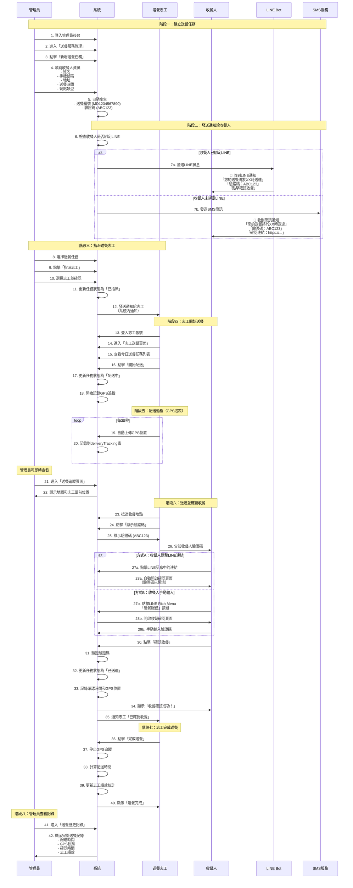

# 台東防災館送餐服務完整流程圖

## 流程圖說明

本文件詳細說明送餐服務的完整流程，包含三個主要角色：
- **管理員**：建立送餐任務、指派志工
- **送餐志工**：執行送餐、上傳GPS、顯示驗證碼
- **收餐人**：接收通知、確認收餐

---

## 完整流程圖



---

## 詳細步驟說明

### 一、管理員建立送餐任務

**頁面**：`/meal-delivery`（送餐服務管理）

**操作步驟**：
1. 點擊「新增送餐任務」按鈕
2. 填寫表單：
   - 收餐人姓名：例如「王小明」
   - 收餐人手機：例如「0912345678」
   - 送餐地址：例如「台東市更生北路616巷9號」
   - 送餐日期：選擇日期
   - 送餐時間：例如「12:00」
   - 餐點類型：例如「午餐」
3. 點擊「確認建立」

**系統自動執行**：
```javascript
// 1. 產生送餐編號
deliveryNumber = `MD${Date.now()}`  // 例如：MD1732770000000

// 2. 產生驗證碼
verificationCode = Math.random().toString(36).substring(2, 8).toUpperCase()
// 例如：ABC123

// 3. 檢查收餐人是否綁定LINE
const recipient = await getRecipientByPhone(recipientPhone);

if (recipient && recipient.lineUserId) {
  // 發送LINE訊息
  await sendLineMessage(recipient.lineUserId, {
    type: 'text',
    text: `【送餐通知】
您的送餐將於 ${deliveryTime} 送達
驗證碼：${verificationCode}
點擊確認收餐：https://taitungaibookingsystem.cc/meal-confirm`
  });
} else {
  // 發送SMS簡訊（目前為模擬模式）
  await sendSMS(recipientPhone, {
    message: `【送餐通知】
您的送餐將於 ${deliveryTime} 送達
驗證碼：${verificationCode}
確認連結：https://taitungaibookingsystem.cc/meal-confirm`
  });
}
```

---

### 二、管理員指派送餐志工

**頁面**：`/meal-delivery`（送餐服務管理）

**操作步驟**：
1. 在送餐任務列表中找到待指派的任務
2. 點擊「指派志工」按鈕
3. 從下拉選單選擇志工
4. 點擊「確認指派」

**系統自動執行**：
```javascript
// 更新送餐任務
await updateMealDelivery(deliveryId, {
  volunteerId: selectedVolunteerId,
  status: 'assigned'
});

// 發送通知給志工（系統內通知）
await createNotification({
  userId: volunteer.userId,
  title: '新的送餐任務',
  content: `您有一筆新的送餐任務：${deliveryAddress}，預計送達時間：${deliveryTime}`
});
```

---

### 三、志工開始送餐

**頁面**：`/volunteer-delivery`（志工送餐頁面）

**操作步驟**：
1. 志工登入系統
2. 進入「志工送餐頁面」
3. 查看今日送餐任務列表
4. 點擊「開始配送」按鈕

**系統自動執行**：
```javascript
// 1. 更新任務狀態
await updateMealDelivery(deliveryId, {
  status: 'in_transit',
  startTime: new Date()
});

// 2. 開始GPS追蹤（每30秒上傳一次）
const gpsInterval = setInterval(async () => {
  navigator.geolocation.getCurrentPosition(async (position) => {
    await uploadGPS({
      deliveryId,
      latitude: position.coords.latitude,
      longitude: position.coords.longitude,
      timestamp: new Date()
    });
  });
}, 30000);
```

---

### 四、志工送達並顯示驗證碼

**頁面**：`/volunteer-delivery`（志工送餐頁面）

**操作步驟**：
1. 志工抵達收餐地點
2. 點擊「顯示驗證碼」按鈕
3. 系統顯示大字體驗證碼（例如：ABC123）
4. 志工告知收餐人驗證碼

**畫面顯示**：
```
┌─────────────────────────┐
│   收餐驗證碼              │
│                          │
│      ABC123             │
│                          │
│  請告知收餐人此驗證碼     │
└─────────────────────────┘
```

---

### 五、收餐人確認收餐

**頁面**：`/meal-confirm`（收餐確認頁面）

**方式A：點擊LINE訊息中的連結**
1. 收餐人點擊LINE訊息中的「點擊確認收餐」連結
2. 自動開啟確認頁面
3. 輸入驗證碼（志工告知的ABC123）
4. 點擊「確認收餐」按鈕

**方式B：透過LINE Rich Menu**
1. 收餐人打開LINE聊天室
2. 點擊下方Rich Menu的「送餐服務」按鈕
3. 開啟確認頁面
4. 輸入驗證碼（志工告知的ABC123）
5. 點擊「確認收餐」按鈕

**系統驗證流程**：
```javascript
// 1. 透過驗證碼查詢送餐任務
const delivery = await findDeliveryByVerificationCode(verificationCode);

// 2. 驗證任務狀態
if (delivery.status === 'delivered') {
  throw new Error('此送餐任務已經確認收餐');
}

// 3. 更新任務狀態
await updateMealDelivery(delivery.id, {
  status: 'delivered',
  confirmedAt: new Date()
});

// 4. 回傳成功訊息
return {
  success: true,
  deliveryNumber: delivery.deliveryNumber,
  volunteerName: volunteer.name,
  message: '收餐確認成功！感謝您的配合。'
};
```

---

### 六、志工完成送餐

**頁面**：`/volunteer-delivery`（志工送餐頁面）

**操作步驟**：
1. 收到「已確認收餐」通知
2. 點擊「完成送餐」按鈕

**系統自動執行**：
```javascript
// 1. 停止GPS追蹤
clearInterval(gpsInterval);

// 2. 計算配送時間
const deliveryTime = confirmedAt - startTime;

// 3. 更新志工績效統計
await updateVolunteerPerformance({
  volunteerId,
  totalDeliveries: +1,
  totalDeliveryTime: +deliveryTime,
  onTimeDeliveries: isOnTime ? +1 : 0
});
```

---

## 關鍵技術實作

### LINE 訊息發送

**檔案**：`server/services/lineService.ts`

```typescript
export async function sendDeliveryNotification(
  lineUserId: string,
  deliveryInfo: {
    deliveryTime: string;
    verificationCode: string;
    deliveryId: number;
  }
) {
  const message = {
    type: 'text',
    text: `【台東防災館送餐通知】

您的送餐將於 ${deliveryInfo.deliveryTime} 送達

驗證碼：${deliveryInfo.verificationCode}

點擊下方連結確認收餐：
https://taitungaibookingsystem.cc/meal-confirm

如有任何問題，請聯絡客服人員。`
  };

  await sendLineMessage(lineUserId, message);
}
```

### 驗證碼驗證

**檔案**：`server/routers.ts`

```typescript
confirmReceiptByCode: publicProcedure
  .input(z.object({
    verificationCode: z.string().length(6),
  }))
  .mutation(async ({ input }) => {
    // 1. 透過驗證碼查詢送餐任務
    const deliveryResult = await database
      .select({
        delivery: mealDeliveries,
        volunteer: volunteers,
        user: users,
      })
      .from(mealDeliveries)
      .leftJoin(volunteers, eq(mealDeliveries.volunteerId, volunteers.id))
      .leftJoin(users, eq(volunteers.userId, users.id))
      .where(eq(mealDeliveries.verificationCode, input.verificationCode))
      .limit(1);

    if (deliveryResult.length === 0) {
      throw new TRPCError({ 
        code: "NOT_FOUND", 
        message: "驗證碼錯誤或送餐任務不存在" 
      });
    }

    const { delivery, user } = deliveryResult[0];

    // 2. 檢查是否已經確認過
    if (delivery.status === 'delivered') {
      throw new TRPCError({ 
        code: "BAD_REQUEST", 
        message: "此送餐任務已經確認收餐" 
      });
    }

    // 3. 更新送餐任務狀態
    await database.update(mealDeliveries)
      .set({ status: 'delivered' })
      .where(eq(mealDeliveries.id, delivery.id));

    return {
      success: true,
      message: "收餐確認成功！感謝您的配合。",
      deliveryNumber: delivery.deliveryNumber,
      volunteerName: user?.name || '未知志工',
    };
  })
```

---

## 常見問題 FAQ

### Q1: 收餐人沒有加入LINE好友怎麼辦？
**A**: 系統會自動降級使用SMS簡訊發送驗證碼。目前SMS為模擬模式，可整合Twilio發送真實簡訊。

### Q2: 驗證碼會重複嗎？
**A**: 驗證碼使用`Math.random().toString(36)`產生，理論上重複機率極低（36^6 = 2,176,782,336種組合）。

### Q3: 收餐人可以重複確認嗎？
**A**: 不行。系統會檢查任務狀態，如果已經是`delivered`狀態，會拒絕重複確認。

### Q4: 志工如何知道收餐人已確認？
**A**: 系統會發送通知給志工，志工頁面也會即時更新任務狀態。

### Q5: 管理員可以即時追蹤志工位置嗎？
**A**: 可以。管理員可進入「送餐追蹤頁面」查看志工當前位置和完整路徑軌跡。

---

## 相關頁面連結

- **管理員後台**：`/admin`
- **送餐服務管理**：`/meal-delivery`
- **送餐追蹤頁面**：`/delivery-tracking`
- **志工送餐頁面**：`/volunteer-delivery`
- **收餐確認頁面**：`/meal-confirm`（公開頁面，無需登入）
- **收餐人管理**：`/admin/recipients`

---

## 資料表結構

### mealDeliveries（送餐任務表）
```sql
- id: 任務ID
- deliveryNumber: 送餐編號 (MD1234567890)
- verificationCode: 驗證碼 (ABC123)
- recipientName: 收餐人姓名
- recipientPhone: 收餐人手機
- deliveryAddress: 送餐地址
- deliveryDate: 送餐日期
- deliveryTime: 送餐時間
- mealType: 餐點類型
- volunteerId: 志工ID
- status: 狀態 (pending/assigned/in_transit/delivered)
- createdAt: 建立時間
- confirmedAt: 確認時間
```

### recipients（收餐人表）
```sql
- id: 收餐人ID
- name: 姓名
- phone: 手機號碼
- lineUserId: LINE用戶ID（綁定後才有）
- address: 地址
- createdAt: 建立時間
```

### deliveryTracking（GPS追蹤表）
```sql
- id: 記錄ID
- deliveryId: 送餐任務ID
- latitude: 緯度
- longitude: 經度
- timestamp: 時間戳記
```

---

## 下一步優化建議

1. **整合 Twilio SMS 服務**：發送真實簡訊給未綁定LINE的收餐人
2. **收餐確認成功通知**：自動發送LINE訊息通知志工「已確認收餐」
3. **路線優化**：使用Google Maps Directions API優化多點送餐路線
4. **推播通知**：志工APP推播提醒送餐任務
5. **評價系統**：收餐人可對送餐服務進行評價

---

**文件版本**：v1.0  
**最後更新**：2025-06-02  
**作者**：台東防災館系統開發團隊
